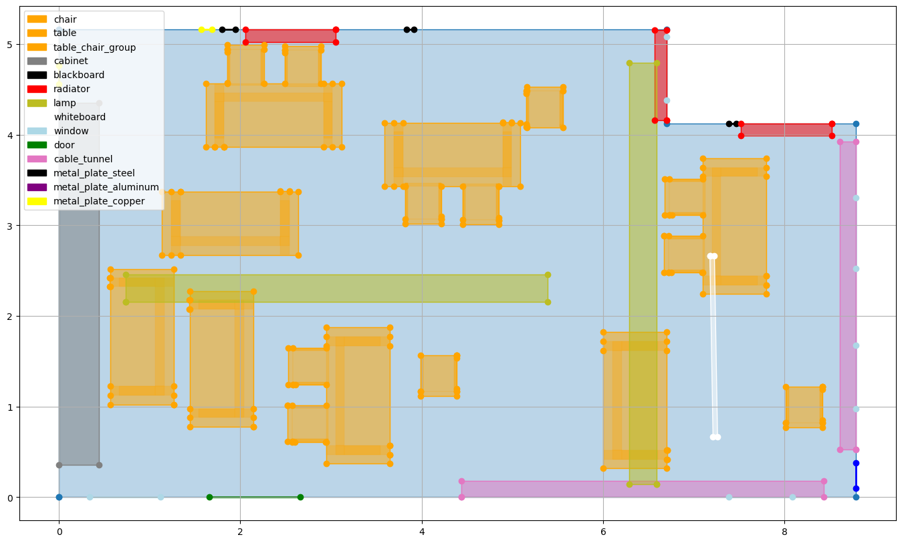
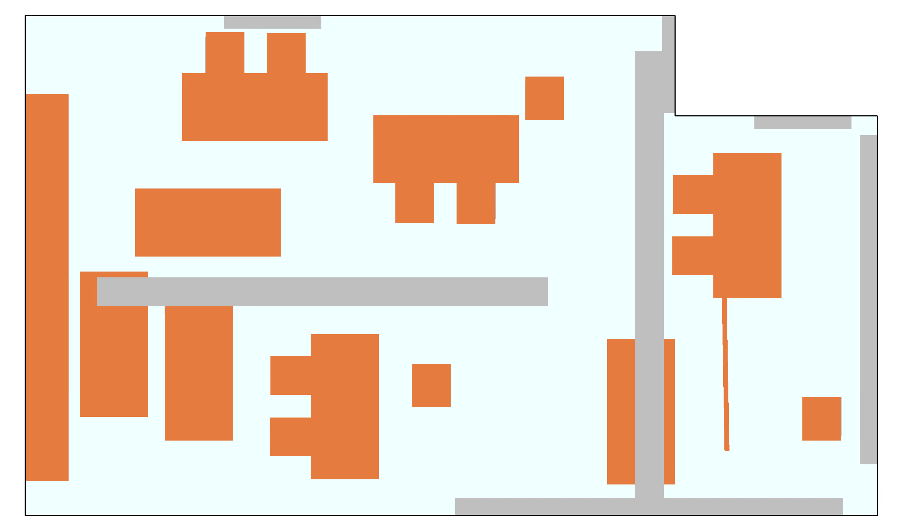
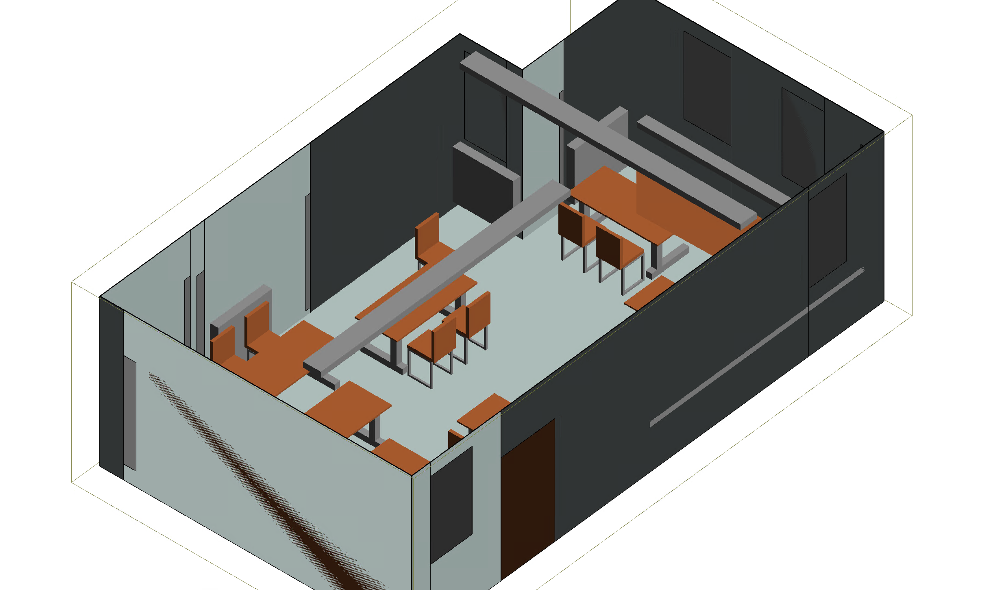
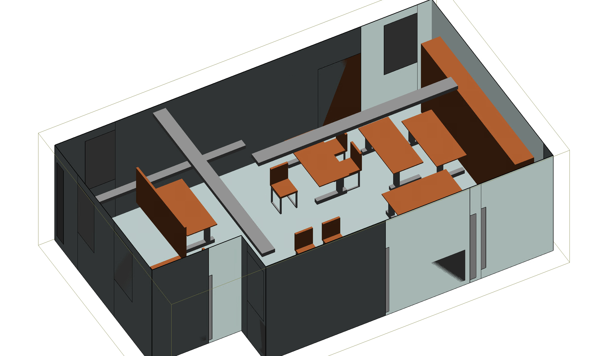

# Overview

This repo allows to generate Wireless InSite (WI) projects that model realistic indoor room environments in an automated manner. By creating a large number of different projects and running RT simulations, we obtain a dataset that can be used to train CNN on indoor RM prediction. The code contains functions to read and write WI compatible files for some of the logic implemented by WI.

The dataset we used for our paper "Radio Map Prediction from Noisy Environment Information and Sparse Observations" ([https://arxiv.org/abs/2602.11950](https://arxiv.org/abs/2602.11950) is available on [https://zenodo.org/records/18631406](https://zenodo.org/records/18631406).

A WI (indoor) project is in general defined by:  

- a *.setup* file containing many of the parameters for the project, e.g. waveforms, study areas, antennas, and references to other files mentioned below
- one *.flp* (floor plan) and several *.object* files defining the geometry of the environment and materials
- a *.txrx* file defining types and locations of Tx and Rx, and which antennas, waveforms they use etc.  

These files are usually generated through the GUI, but we can also use scripts to e.g. copy an *.object* file, change some location or material parameters and add a reference to the altered file in the setup file.

In order to run a large number of simulations, it is necessary to start them from the shell instead of the GUI.
In this case, some of the files mentioned above (*.setup*, *.txrx*) actually become obsolete, instead a *.xml* file containing all their information is needed.

# File/Folder Structure
- [modules](modules) contains the code
    - [modules/project.py](modules/project.py) contains the logic to define floor plans, geometries and objects
        - we basically use 2D geometries from the shapely module, allowing us to easily check whether objects overlap, are contained inside of each other etc.
        - additionally, we add a lower and an upper height value (2.5D), materials and names
    - [modules/read_wi_files.py](modules/read_wi_files.py) contains functions to read WI files in order to load objects and floorplans
        - floorplans can be generated randomly anyways, but we use the logic from here to load predefined objects like chairs, lamps, tables etc.
    - [modules/project_creation.py](modules/project_creation.py) contains the logic to create new projects 
        - we load parameters from a config file in [configs](configs) to define e.g. the size of the room, possible parameters for the materials, number of objects etc.
        - the floor plan is always either rectangular of L-shaped
        - there are three types of things that can be added to the environment besides or additionally to the floor plan:
            1. pre-defined objects in [wi_project_files](wi_project_files), these are loaded and randomly rotated and moved, shapes and sizes are not changed
            2. wall parts like windows, doors, metal plates which are completely flat and saved as part of the floor plan
            3. objects on the walls/ceiling which are modeled as simple cuboids with varying shapes/sizes, for these we make sure that they do not block wall parts like windows
    - [modules/nb_testing_plotting.ipynb](modules/nb_testing_plotting.ipynb) is used for visualization and testing
- [tests](tests) contains all tests
- [wi_project_files](wi_project_files) contains an example of a WI project, from which we take objects
- [wi_templates](wi_templates) contains WI files with some placeholders, e.g. a *.setup* file in which we add a floor plan and objects
- [configs](configs) contains config files with parameters for project generation
- config files are yaml files with the following structure:
    - values for parameters can be given as:
        - fixed value
        - list of the form [v_min, v_max], in that case we draw a random number from the interval [v_min, v_max], which is either a float or an int, if both v_min, v_max are ints
        - list of arbitrary length != 2 or of elements that are not numbers (e.g. material), in this case we draw one element uniformly at random
    - a config should contain more or less the same keys and similar value types as the given ones
    - *wall_objects* can be arbitrary objects of a certain material and shape inside a wall or rectangular polygons right in front of a wall (depth > 0)
    - *objects* are loaded from files with the same name expected in *wi_project_files*
    - *materials* can be given in more or less arbitrary dictionary form, they just have to be understood by WI later
- [script_create_projects.py](script_create_projects.py) can be used to generate an arbitrary number of projects based on a config
- [script_copy_projects.py](script_copy_projects.py) can be used to generate an arbitrary number of copies of existing projects based on a config and with randomization of e.g. object positions or material parameters
- [script_rasterize_projects.py](script_rasterize_projects.py) can be used to create raster images representing the indoor scenarios. For each scenario, we create slices at several height values and we show per pixel the presence of classes corresponding to the materials
- [script_process_simulation_data.py](script_process_simulation_data.py) can be used to process the h5 files obtained from the simulations which contain the raw channel data into gray-scale radio maps

# Extension/Adaptation
You can change parameters in the config or create a new config. An easy way to extend the indoor environments is to place more WI object files in [wi_project_files](wi_project_files) and to mention them in a config. 

# Some Figures
Here we show an example of a floor plan randomly generated from [configs/config1.yml](configs/config1.yml), plotted using shapely/[nb_testing_plotting.ipynb](nb_testing_plotting.ipynb), and the result loaded in WI in 2D and 3D.

# Material Properties, Sources
See chapter 10 in the WI reference manual for an explication how materials are defined and used.
We use the material types "Layered Dielectric", which requires as parameters per layer the relative permittivity, conductivity, roughness and thickness, and "PEC", which doesn't require any parameters.
Here we list the references used:
- wood: https://jwoodscience.springeropen.com/counter/pdf/10.1007/s10086-003-0575-1.pdf, with $\sigma = \epsilon''\omega\epsilon_0$
- steel/copper/aluminum: https://web.archive.org/web/20110606042043/http://hypertextbook.com/facts/2006/UmranUgur.shtml can be modeled effectively as PEC at GHz frequencies - we have two types of metal, one PEC, one uses:
    - aluminum: conductivity [3.546e+07, 3.774e+07], permittivity 1 (ITU)
    - copper: [5.814e+07, 5.988e+07], 1
    - steel: [1.334e+06, 6.206e+06], 1
- glass: https://www.am1.us/wp-content/uploads/Documents/E10589_Propagation_Losses_2_and_5GHz.pdf, with $\sigma=\omega\epsilon'\tan(\delta)$
- concrete: https://www.ndt.net/article/ndtce03/papers/v032/v032.htm#:~:text=results%20are%20presented%20in%20the,2%20%28for%20saturated%20concrete, https://www.sciencedirect.com/science/article/pii/S0950061821029779#s0065
